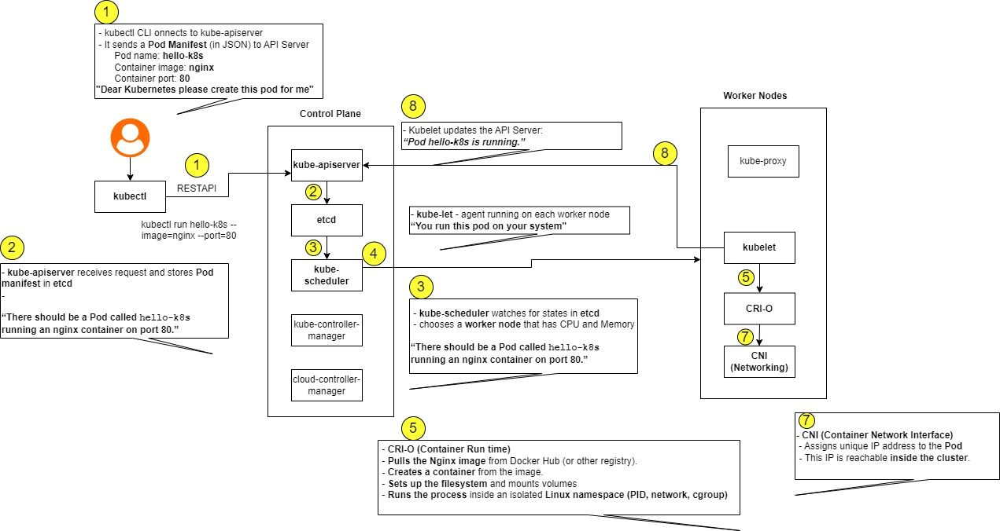
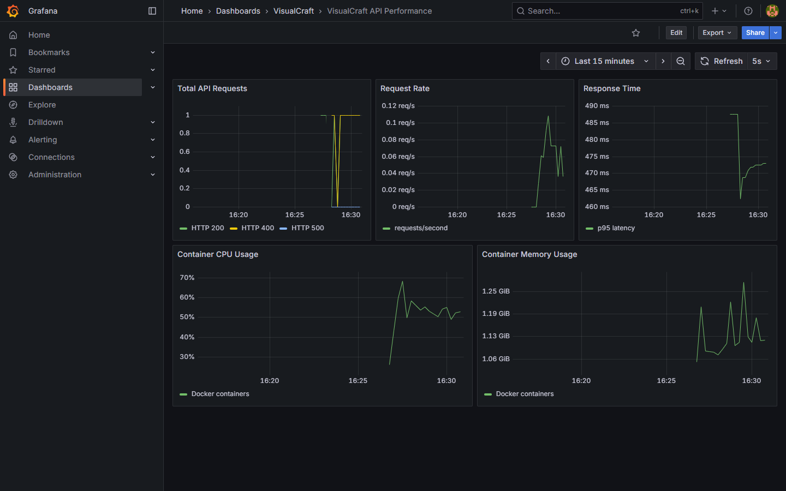

# Assignment 3: VisualCraft

## Aim

To deploy the supplied AI artistic style-transfer service with automatic restart, API monitoring, container resource monitoring and a test-before-deploy pipeline.

## Architecture

```text
JPEG request
     |
     v
Metrics proxy :5001 ----> AI style service :5001
     |
     +----> Prometheus :9090 ----> Grafana :3000
                                     |
cAdvisor ----------------------------+
```

The assignment image `urmsandeep/ai-artistic-style-service` performs the image transformation. A small proxy records request counts, status codes and latency without modifying the supplied image. cAdvisor provides CPU and memory metrics for the containers.

## Start the services

```powershell
docker compose up --build -d
docker compose ps
```

The local services are:

| Service | Address |
|---|---|
| Style-transfer API | <http://localhost:5001> |
| Prometheus | <http://localhost:9090> |
| Grafana | <http://localhost:3000> |

Grafana is provisioned automatically. Sign in with `admin` / `admin` and open the **VisualCraft API Performance** dashboard in the VisualCraft folder. These credentials are only intended for the local lab setup.

## Test the API

Use a JPEG image of your choice:

```powershell
curl.exe -X POST http://localhost:5001/styleTransfer -F "image=@sample-input.jpg" --output styled-image.jpg
```

A successful request creates `styled-image.jpg`. Sending a request without an image returns HTTP 400, which can also be used to check status-code grouping in Grafana.

```powershell
curl.exe -i -X POST http://localhost:5001/styleTransfer
```

## Monitoring

Prometheus scrapes the proxy every five seconds. The supplied Grafana dashboard contains:

- total API requests grouped by status code
- request rate per second
- p95 response time
- container CPU usage
- container memory usage

The raw application metrics are available at <http://localhost:5001/metrics>.

## Restart test

The application services use `restart: always`. To simulate a failure:

```powershell
docker exec visualcraft-api sh -c "kill -TERM 1"
Start-Sleep -Seconds 10
docker ps --filter "name=visualcraft-api"
curl.exe http://localhost:5001/health
```

Sending `SIGTERM` to the container's main process simulates an application process failure. Docker Compose restarts the container and the health request succeeds again after the upstream service is reachable.

## CI/CD

Two pipeline configurations are included:

- `.github/workflows/assignment-3.yml` runs proxy tests, validates Compose and builds the proxy image on pushes and pull requests.
- `Jenkinsfile` runs the same checks before pulling and deploying the complete Compose stack on the Jenkins machine.

This keeps deployment after the test stage. If a test or configuration check fails, the deploy stage does not run.

## Local tests

```powershell
python -m venv .venv
.\.venv\Scripts\Activate.ps1
pip install -r proxy/requirements.txt -r tests/requirements.txt
pytest -q
docker compose config --quiet
```

Completed checks are recorded in [RESULTS.md](RESULTS.md).

## Stop the services

```powershell
docker compose down
```

Prometheus and Grafana data remain in named volumes. Use `docker compose down -v` only when that monitoring history is no longer required.

## Evidence

Input image:



Stylized output returned by `/styleTransfer`:


Grafana dashboard after the API tests:


