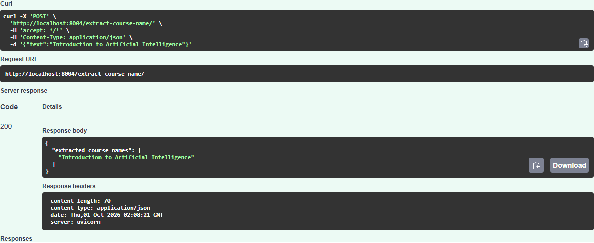

# Execution Results

Run date: 1 October 2026.

## Fine-tuning

The Docker training stage fine-tuned `dbmdz/bert-large-cased-finetuned-conll03-english`, the model named in the reference exercise, on 442 synthetic examples. Training completed three epochs on CPU with batch size 4, learning rate `2e-5` and seed 42. The model has 24 hidden layers, hidden size 1024 and 332,532,739 parameters after replacing the classification head with three course labels.

Training took 1,313.92 seconds, about 22 minutes, excluding downloads and image packaging. Validation entity F1 was 100% after each epoch. The trainer retained `checkpoint-111` from epoch 1 because the later epochs tied its F1. The test split was not used to select the checkpoint.

| Measurement | Result |
|---|---:|
| Validation entity F1 before fine-tuning | 0% |
| Validation entity F1 after fine-tuning | 100% |
| Test exact-course precision | 100% |
| Test exact-course recall | 100% |
| Test exact-course F1 | 100% |
| Test sentences with all names correct | 42 / 42 |

The test contained 48 course entities. The model returned 48 names, all exact matches. Evaluation used the checkpoint copied from the built Docker image; the running API produced the same predictions for all 42 test sentences.

Raw records: [training metrics](evidence/training-metrics.json) and [all test predictions](evidence/test-metrics.json).

## Application and Docker checks

| Check | Result |
|---|---|
| Local pytest run, including the trained checkpoint | 16 passed, 0 skipped |
| Health endpoint and six POST requests | 7 checks passed |
| Docker Compose configuration | Valid |
| Container health | Healthy |
| Container user | `appuser` |
| Container / laptop ports | `80` / `8004` |

The POST checks covered the reference example, two names in a sentence, previously unseen course titles, text without a course, whitespace-only input and the token limit. The last two returned HTTP 422. The weights are packaged in the image and loaded locally during startup.

For the reference request:

```json
{"text": "Introduction to Artificial Intelligence"}
```

the API returned HTTP 200:

```json
{"extracted_course_names": ["Introduction to Artificial Intelligence"]}
```

[API responses](evidence/api-responses.json) · [pytest report](evidence/test-results.xml)

The following screenshot shows an executed Swagger request, not the example response schema:



## Observations

There were no extraction errors in the 42-example test split. This is a small synthetic dataset with separate course titles and templates in each split. A perfect score here does not establish accuracy on real college brochures or arbitrary text. All test predictions are retained in the report.

The implementation uses the reference's BERT-large model, three epochs, batch size 4 and learning rate `2e-5`. It implements course-span labels and decoding rather than returning the whole input. Python 3.12 is used instead of the example's Python 3.8. The container serves on port 80; host port 8004 keeps this assignment separate from the earlier services.
