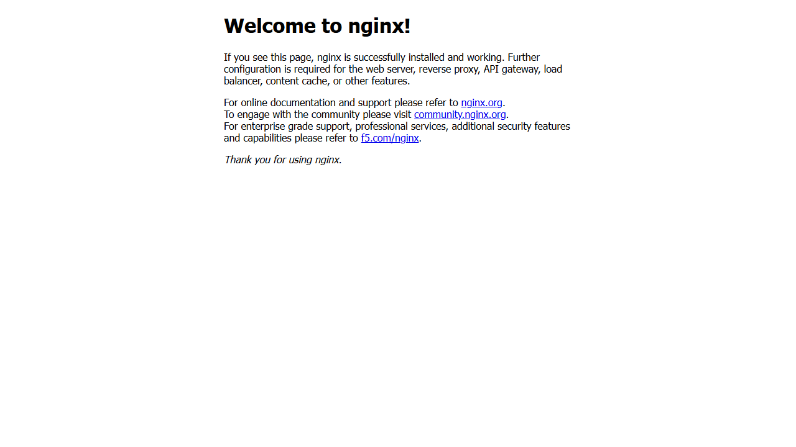

# Exercise 1 Results

Run date: 9 October 2026.

The exercise ran on Minikube 1.39.0 with Kubernetes 1.37.0, using Docker Desktop 4.94.0 and Docker Engine 29.8.2. The `devops-exercises` profile and `exercise1` namespace kept it separate from the existing assignments.

## Pod and service

The pod and service were created with `kubectl run` and `kubectl expose`, following the source exercise. The pod reached `1/1` Ready with zero restarts.

```text
NAME        READY   STATUS    RESTARTS   IP           NODE
hello-k8s   1/1     Running   0          10.244.0.3   devops-exercises

NAME        TYPE       CLUSTER-IP    PORT(S)        SELECTOR
hello-k8s   NodePort   10.99.69.28   80:31821/TCP   run=hello-k8s
```

The service's ready endpoint was `10.244.0.3:80`, matching the Nginx pod. Kubernetes also accepted `hello-k8s.yaml` in a server-side dry run.

## HTTP and browser check

`minikube service hello-k8s --namespace exercise1 --url` created the Windows tunnel at `http://127.0.0.1:63652/`. The request returned HTTP 200 with `Server: nginx/1.31.6` and the Nginx welcome page. The browser displayed the same page.

`verify.ps1` passed all five checks: pod readiness, image and container port, NodePort configuration, ready service endpoint and HTTP response. The resolved image digest and measured values are stored in [verification.json](evidence/verification.json); the actual response is in [nginx-response.html](evidence/nginx-response.html).



## Observation

On Windows with the Docker driver, the node IP is not directly reachable from the host. The Minikube service tunnel provides browser access and must remain open while using its URL. The recorded tunnel port is specific to this run.

The initial cluster setup waited on an image preload. Starting with `--preload=false` allowed setup to continue using the downloaded base image and normal Kubernetes image downloads. This option changes the download strategy, not the pod or service configuration.
