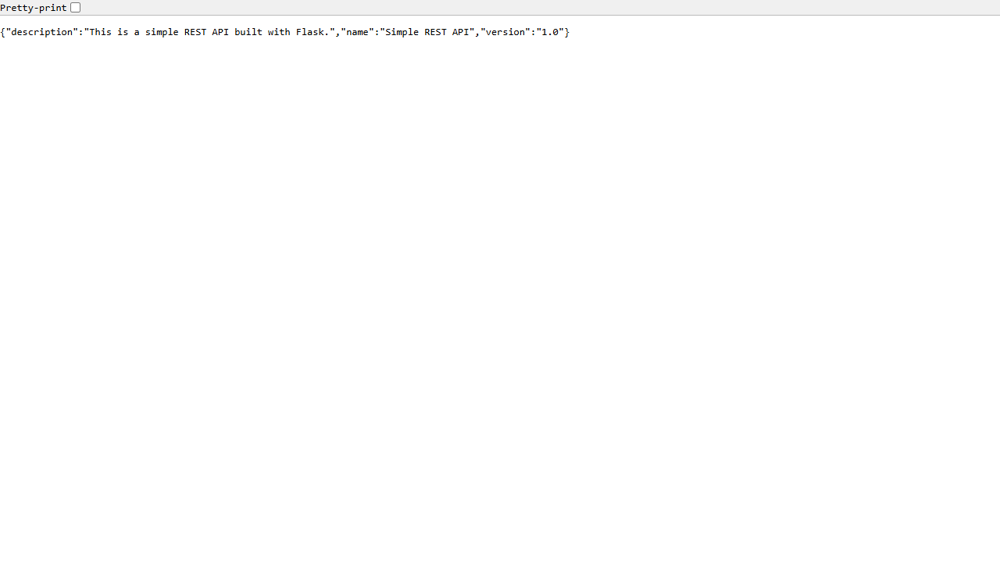

# Exercise 4 Results

Run date: 9 October 2026. Docker Engine 29.8.2.

The Flask image built successfully and all three unit tests passed. The standalone Flask test returned HTTP 200 before the final three-container setup was created.

## Network and containers

Docker created `my-bridge-net` with driver `bridge`, subnet `172.23.0.0/16` and gateway `172.23.0.1`. All three lab containers were running and appeared in the network inspection:

| Container | DNS alias | Address |
| --- | --- | --- |
| exercise4-mysql | mysql | 172.23.0.2 |
| exercise4-redis | redis | 172.23.0.3 |
| exercise4-flask | flask | 172.23.0.4 |

The Flask image used Python 3.9, Flask 2.0.1 and Werkzeug 2.0.3. The pulled server images ran MySQL 26.7.0 and Redis 8.10.2. The API was published at `127.0.0.1:15004`, mapping to container port 5001. Neither MySQL nor Redis published a host port.

## Connectivity

From inside Flask, `mysql` and `redis` resolved to the addresses above. Each received three pings with zero packet loss. MySQL accepted a TCP connection on 3306 and returned its protocol-10 handshake. `SHOW DATABASES` included `devopsdb`, `information_schema`, `mysql`, `performance_schema` and `sys`. Redis answered `PING` with `PONG` on port 6379.

The host request to `http://127.0.0.1:15004/about` returned HTTP 200 with the expected API name, version and description. The browser displayed the same JSON:

## Cleanup

The standalone test container was removed after its check. After verification, cleanup removed the three Exercise 4 containers, their anonymous lab volumes and `my-bridge-net`. The lab contains no saved application data; the temporary MySQL database was discarded. Existing assignment containers and networks were left untouched, and the image remains available for a repeat run.

## Evidence

- [Unit tests](evidence/unit-tests.txt)
- [Standalone API check](evidence/standalone.json)
- [Installed app versions](evidence/app-versions.json)
- [Docker network inspection](evidence/network-inspection.json)
- [DNS, ping, server and API results](evidence/verification.json)
- [Cleanup confirmation](evidence/cleanup.json)

Host port 5001 was already occupied, so only the host side of the mapping changed to 15004. The package-index download stalled over HTTP; rebuilding with Debian's HTTPS endpoints completed the installation of `iputils-ping`.
