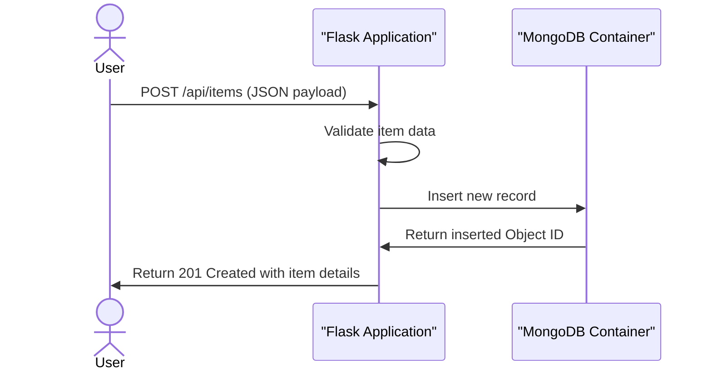

# DevOps Laboratory

This repository contains practical DevOps laboratory exercises and assignments.

## Overview

This project provides developers with practical laboratory environments to learn and implement operations practices. It takes application code and database configurations, connects them through isolated networks, and produces a fully containerized deployment. Teams can use these setups to understand health monitoring, persistent storage, and automated recovery without complicated initial configurations.

## System Architecture


## Assignments

- [Assignment 1: Dockerized Multi-Container Web Application](./Assignment-1/README.md)

Assignment 1 demonstrates a Flask CRUD application and MongoDB running in separate Docker containers, persistent storage with Docker volumes, custom bridge networking through the Docker SDK for Python, and automatic container health monitoring and recovery.

## Features

### Inventory Management
The core system includes a complete inventory tracker that allows users to create, read, update, and delete items. This flow highlights how the web application communicates with the isolated database container to persist records.



### Automated Health Monitoring
The setup includes monitoring capabilities that constantly check the operational status of the containers. If a service becomes unresponsive, the system automatically detects the failure and attempts a restart to restore functionality.

## Technologies Used

* Python
* Flask
* MongoDB
* Docker
* Docker Compose
* Gunicorn
* PyMongo

## API Documentation

### Web UI Routes

**GET /**
Renders the main HTML interface displaying all current inventory items.

**POST /items**
Accepts form data to create a new inventory item and redirects back to the main interface.

**POST /items/<item_id>/update**
Accepts form data to update an existing item and redirects back to the main interface.

**POST /items/<item_id>/delete**
Deletes an item via form submission and redirects back to the main interface.

**GET /favicon.ico**
Returns a 204 No Content response for browser favicon requests.

### REST API Endpoints

**GET /health**
Checks the connection status between the Flask application and the MongoDB database.

Response:
```json
{
  "service": "flask-app",
  "status": "healthy"
}
```

**GET /api/items**
Retrieves a list of all inventory items sorted by creation date.

Response:
```json
[
  {
    "id": "60d5ec49c1b4a928e46955a1",
    "name": "Keyboard",
    "description": "Mechanical keyboard",
    "quantity": 5,
    "created_at": "2023-10-12T10:00:00+00:00"
  }
]
```

**POST /api/items**
Creates a new inventory item. Requires a JSON payload.

Request:
```json
{
  "name": "Monitor",
  "description": "27-inch display",
  "quantity": 2
}
```

Response:
```json
{
  "id": "60d5ec49c1b4a928e46955a2",
  "name": "Monitor",
  "description": "27-inch display",
  "quantity": 2,
  "created_at": "2023-10-12T10:05:00+00:00"
}
```

**GET /api/items/<item_id>**
Retrieves details for a specific inventory item using its unique identifier.

Response:
```json
{
  "id": "60d5ec49c1b4a928e46955a2",
  "name": "Monitor",
  "description": "27-inch display",
  "quantity": 2,
  "created_at": "2023-10-12T10:05:00+00:00"
}
```

**PUT /api/items/<item_id>**
Updates an existing inventory item with new data.

Request:
```json
{
  "name": "Monitor",
  "description": "27-inch 4K display",
  "quantity": 3
}
```

Response:
```json
{
  "id": "60d5ec49c1b4a928e46955a2",
  "name": "Monitor",
  "description": "27-inch 4K display",
  "quantity": 3,
  "created_at": "2023-10-12T10:05:00+00:00"
}
```

**DELETE /api/items/<item_id>**
Permanently removes a specific item from the database. Returns a 204 No Content HTTP status upon success.

## Getting Started

To launch the multi-container environment locally, ensure Docker Desktop is running and execute the following command in the `Assignment-1` directory.

```bash
docker compose up --build -d
```

This command will construct the custom network, initialize the database volume, build the Flask application image, and start both containers in the background. You can then access the web interface at `http://localhost:5000`.

To stop the environment while preserving your database records, run:

```bash
docker compose down
```

[](https://dokugen.samueltuoyo.com)